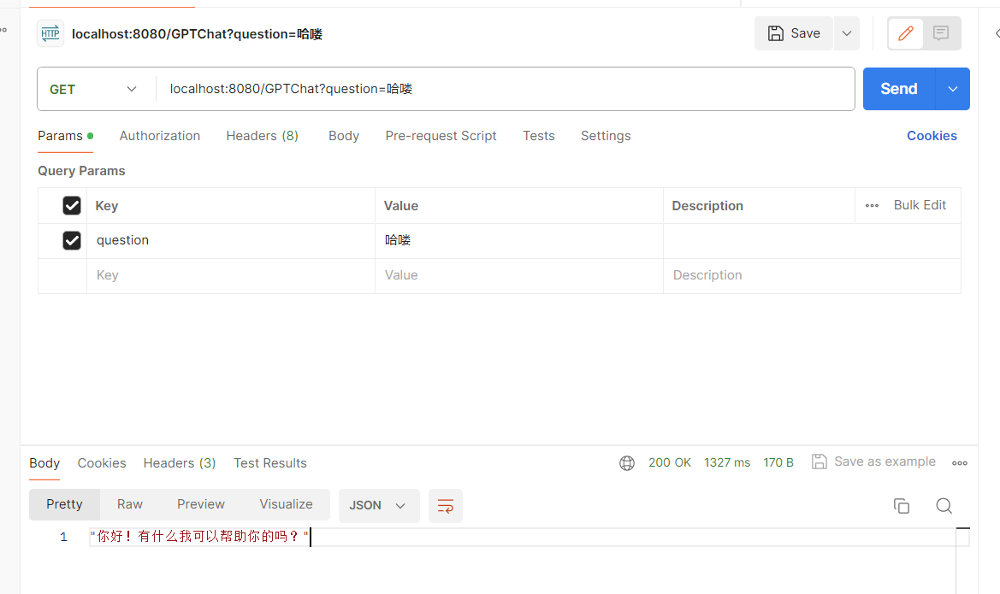

# 这是什么？
在做毕设时候需要接入一个GPT接口实现问答功能。
网上已经有很多现有的，可以基于其实现角色管理、对话等功能。

本着“能用就行”和“极致简洁”，抛弃掉其他所有功能。
只保留了最基础的——发送消息、收到回答。

这一定是最最最最最最基础的功能了！
当然，也有且仅有此功能哈哈哈。

调用效果如图：

本功能基于[9ssi7大佬的作品](https://github.com/9ssi7/gpt)进行删删删删删